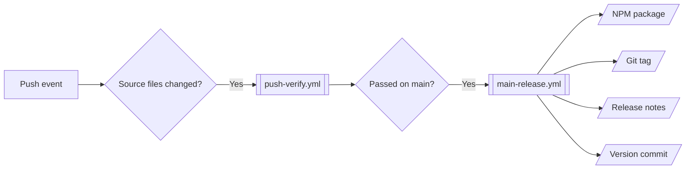

# Contributing

[](https://github.com/semantic-release/semantic-release)

Please read through this guideline before contributing. Every command runs from the repository root.

> [!note]
> [`CLAUDE.md`](../CLAUDE.md) maps the repository, and [`.claude/rules/`](../.claude/rules/) holds the rules for the terminal layout, the workflows, and the documents. Claude Code picks up the `conventional-commit` plugin from [`.claude/settings.json`](../.claude/settings.json).

> [!important]
> Versions are bumped by Semantic Release in [`main-release.yml`](./workflows/main-release.yml). Never edit `version` by hand.

## Prerequisites

Required software for development and CI:

| Tool                           | Version  | Pinned In             |
| ------------------------------ | -------- | --------------------- |
| [Node.js](https://nodejs.org/) | `26.5.0` | [`.nvmrc`](../.nvmrc) |

Run `nvm install` after pulling a change to `.nvmrc`. Users only need the Node.js version in the `engines` field of [`package.json`](../package.json).

## Getting Started

`npm ci` installs the dependencies and, through the `prepare` script, the Husky hooks. Then start the dashboard:

```shell
npm ci
npm start
```

`npm start` reads and writes your real `~/.terminal-sigma/progress.json`. To try a change without touching your journey, point it at a throwaway folder:

```shell
TERMINAL_SIGMA_HOME="$(mktemp -d)" npm start
```

## Branching Strategy

This repository follows a simple [GitHub Flow](https://docs.github.com/en/get-started/using-github/github-flow), and Semantic Release cuts a release from `main`:

| Branch           | Release | Created From | Merge To |
| ---------------- | ------- | ------------ | -------- |
| `feature-<name>` |         | `main`       | `main`   |
| `main`           | `#.#.#` |              |          |

Commit messages follow [Conventional Commits](https://www.conventionalcommits.org/en/v1.0.0/), and the type decides the release: `feat` publishes a minor version, `fix` a patch, and the rest publish nothing.

## Commands

[NPM scripts](../package.json) are organized with [ESLint Package.json Conventions](https://eslint.org/docs/latest/contribute/package-json-conventions):

| Command   | Purpose                                                                 |
| --------- | ----------------------------------------------------------------------- |
| `build`   | Clean `build/`, compile TypeScript, and rewrite path aliases            |
| `prepack` | Build before `npm pack` or `npm publish`, so the package is never stale |
| `start`   | Build, then run the dashboard                                           |
| `test`    | Run Prettier, xo, and AVA                                               |

## Git Hooks

Husky runs 2 hooks, and a failure means fixing the code, never skipping the hook:

| Hook         | Runs                                                                      |
| ------------ | ------------------------------------------------------------------------- |
| `commit-msg` | commitlint against Conventional Commits                                   |
| `pre-commit` | lint-staged: Prettier on every staged file, and xo on staged source files |

## Workflows

GitHub Actions workflows for testing and releasing:



Publishing needs the `NPM_ACCESS_TOKEN` repository secret: a granular NPM token with read and write access that bypasses 2FA. NPM caps these at 90 days, so replace it when a release fails with 401 or 404:

```shell
gh secret set NPM_ACCESS_TOKEN --repo SiegeSailor/Terminal-Sigma
```
