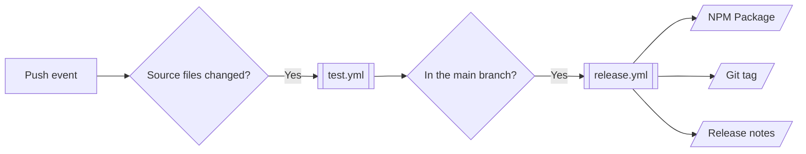

# CONTRIBUTING

Please read through the following guideline before making any contributions. You can find more details on the project structure, coding standards, architecture decisions, and compliance requirements in [.github/copilot-instructions.md](./.github/copilot-instructions.md) and [.github/instructions/](./.github/instructions/).

This repository has enabled GitHub Copilot and any other compatible A.I. code assistants to help contributors. Please see [.github/](./.github/) for agents and skills.

## Prerequisites

Required software for development and CI:

- [Node.js](https://nodejs.org/): `>= 25.2.1`

## Branching Strategy

This repository follows a simple [GitHub Flow](https://docs.github.com/en/get-started/using-github/github-flow) with some naming conventions to trigger [Semantic Release](https://github.com/semantic-release/semantic-release) for releases:

| Branch           | Release | Created From | Merge To |
| ---------------- | ------- | ------------ | -------- |
| `feature-<name>` |         | `main`       | `main`   |
| `main`           | `#.#.#` |              |          |

## Commands

[NPM scripts](./package.json) are organized with [ESLint Package.json Conventions](https://eslint.org/docs/latest/contribute/package-json-conventions):

| Command | Purpose |
| ------- | ------- |
|         |         |

## Workflows

GitHub Actions workflows for testing and releasing:

